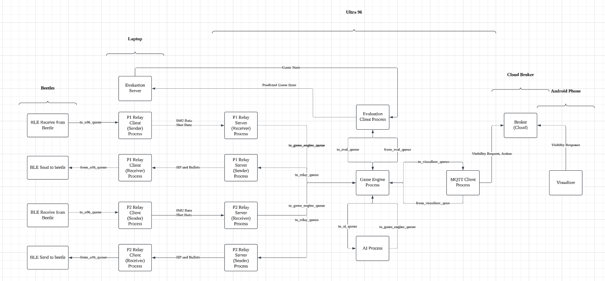
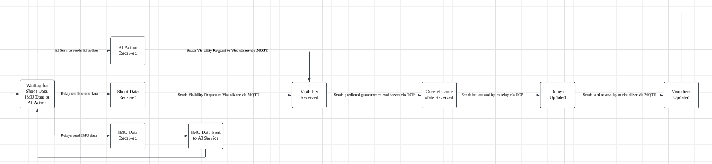

# External Comms

This repoistory includes the external communication system for the capstone project, which runs primarily on a remote Ultra 96 server.

## System Architecture


This system includes 4 major hardware components. The beetles, the laptop, the U96 and the android visualizer.

## Event Flow



## How to run locally on laptop

The following commands are run from the `/external-comms` directory.

### Initialization

1. Add a .env file to the root of the external-comms folder

```bash
MQTT_USERNAME
MQTT_PASSWORD
```

2. Create a venv and pip install requirements.txt

```bash
pip install -r requirements.txt
```

### Running the evaluation server and evaluation web client (on laptop)

1. Open a new terminal and change directories into /server

```bash
cd src/core/eval_server/server
```

2. Run the evaluation server

```bash
bash run_server.sh
```

3. Copy full path of src/core/eval_server/index.html and run in web browser

4. Enter `127.0.0.1` as the IP and 16 `a` as the password.

5. Press Login. You should see the eval web client and a connection on the evaluation server's terminal.

### Running the 1 player game

1. On a seperate terminal run the game.

```bash
python3 1_player_game.py
```

2. Enter the port number as shown on the web client.

3. Now, the game engine should have started. 4 TCP servers should have opened for listening and the game engine should have connected to the MQTT broker.

### Running the visualizer

1. Ensure the visualizer is connected to the MQTT broker as well.

### Running the full game with test relay clients

1. To test clients locally, open a new terminal and run

```bash
python3 -m test.action.test_action
```

2. Enter `127.0.0.1` and `8002` for player 1's server receiver address and port and `127.0.0.1` and `8003` for player 1's server sender address and port.

3. If you want to initiate player 2 clients, follow the same steps and open port `8004` and `8005`.

4. Press next on the web client to start the game. To send a packet from the test client, follow the instructions on the client's terminal (eg. "s" and Enter to send shoot packet)

5. After a packet is sent, the visualizer has to send a visiblity response to complete the event.

## Running on U96

### Running the evaluation server and evaluation web client on laptop.

1. Open a new terminal and change directories into /server

```bash
cd src/core/eval_server/server
```

2. Run the evaluation server

```bash
bash run_server.sh
```

3. Copy full path of src/core/eval_server/index.html and run in web browser

4. Enter `127.0.0.1` as the IP and 16 `a` as the password.

5. Enter 1 or 2 player game.

6. Press Login. You should see the eval web client and a connection on the evaluation server's terminal.

### Reverse tunnel from U96 to laptop's evaluation server.

1. Ensure that FortiClient is running

2. Run this command and replace 'xxxxx' with the port you see on the evaluation web browser.

```bash
ssh -R 8888:127.0.0.1:xxxxx xilinx@makerslab-fpga-21.d2.comp.nus.edu.sg
```

### Running the game on U96

1. Ensure that FortiClient is running

2. SSH into U96

```bash
ssh xilinx@makerslab-fpga-21.d2.comp.nus.edu.sg
```

3. Activate the pyenv

```bash
source /etc/profile.d/pynq_venv.sh
```

4. CD into 'external-comms' folder and start the game.

```bash
sudo -E python3 2_player_game.py
```

5. Enter port 8888 when prompted.

6. If you are running the game WITHOUT Eval server for testing purposes, just ignore the "Eval Server Timeout" message in the console. 

## Troubleshoot
### Pipe close unexpectedly
While the game is running, if the SSH closes unexpected, be it timeout or VPN issues, the game will not shut down gracefully and the relay ports (8002-8005) will be left dangling. To solve this:

1. Run `sudo lsof -i :PORT_NUMBER` for 8002 - 8005
2. Run `kill -9 PROCESS_ID` for all the respective processes
3. Run `ps aux` to see the dangling running game (It should say like python 2_player_game.py)
4. Run `kill -9 PROCESS_ID` for the game